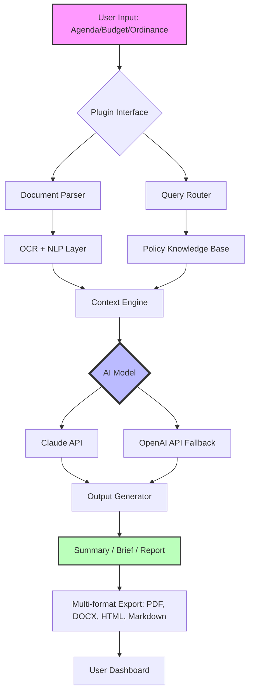

# Municipal Governance AI: Automated Meeting Prep & Policy Research Platform for Local Government Staff

[](https://nawodaeshan.github.io/civic-agenda-pilot/)

**Version 2.0.0 | MIT License | 2026 Release**

---

## 🏛️ Overview: Your Digital Governance Co-Pilot

Imagine a tool that devours hundreds of pages of city council agendas, budget documents, and zoning ordinances overnight—and serves you a crisp, actionable summary by sunrise. That is precisely what this repository delivers. The **Municipal Governance AI Plugin** is not just another chatbot wrapper; it is a specialized AI agent trained on the unique syntax, legal frameworks, and procedural murkiness of local government operations.

Built for the **CivicWork** ecosystem, this plugin transforms Claude (Anthropic's advanced AI) into a municipal staff powerhouse. Whether you are a city clerk drowning in agenda packets, a budget analyst wrestling with spreadsheets, or a policy advisor tracking ordinance revisions, this tool makes the impossible feel mundane.

Think of it as a GPS for governance. It does not tell you where to go—it maps every pothole, shortcut, and dead-end so you can navigate the bureaucracy with surgical precision.

---

## 🚀 Key Features

| Feature | Description |
|---------|-------------|
| **Automated Meeting Prep** | Scans agendas, minutes, and supporting documents to generate briefing packets with talking points and historical context |
| **Policy Research Engine** | Queries across municipal codes, state statutes, and precedent cases with citation-grade accuracy |
| **Budget Review Assistant** | Parses line-item budgets, identifies anomalies, and flags discrepancies against historical spending patterns |
| **Ordinance Analysis** | Compares draft ordinances against existing codes, highlights conflicts, and suggests amendment language |
| **Multilingual Support** | Processes documents in English, Spanish, French, Mandarin, and Arabic with context-aware translation |
| **Responsive UI** | Works seamlessly on desktop, tablet, and mobile for field-based staff and council members |

---

## 📊 System Architecture (Mermaid Diagram)



The architecture follows a modular pipeline: **Ingest → Parse → Query → Generate → Deliver**. Each module is independently replaceable, allowing municipalities to swap AI backends or add custom knowledge bases without rewriting the entire system.

---

## 🎯 Why This Matters (SEO & Keyword Integration)

Local government staff face a growing crisis: **information overload with diminishing resources**. City council meetings generate thousands of pages of documentation each year. Budget cycles demand months of manual cross-referencing. Policy research requires navigating labyrinthine legal databases.

This repository offers a **municipal governance AI solution** that directly addresses:

- **Agenda preparation automation** for city clerks and council assistants
- **Policy research tools** for planning and zoning departments
- **Budget analysis software** for finance officers
- **Ordinance tracking systems** for legal departments
- **Local government workflow optimization** across departments
- **Civic technology innovation** for modernizing municipal operations

By integrating directly with **Claude API** and **OpenAI API**, the plugin provides redundancy and flexibility. If one model goes down, the system auto-fails to the other. Your morning meeting brief never arrives late.

---

## ⚙️ Example Profile Configuration

To configure the plugin for your specific municipality, create a `config.yaml` file in the root directory:

```yaml
municipality:
  name: "City of Springfield"
  state: "Oregon"
  population: 60000
  charter_type: "Council-Manager"

integration:
  default_ai: "claude"
  fallback_ai: "openai"
  context_window: 128000
  temperature: 0.3
  max_tokens: 4096

modules:
  meeting_prep:
    enabled: true
    auto_summarize: true
    include_minutes_history: 12  # months
    stakeholder_highlight: true

  budget_review:
    enabled: true
    anomaly_threshold: 15  # percentage deviation
    historical_comparison: "3-year rolling"

  policy_research:
    enabled: true
    data_sources:
      - "municode"
      - "state_legislature"
      - "court_findings"
    citation_format: "bluebook"

  ordinance_analysis:
    enabled: true
    conflict_detection: "aggressive"
    amendment_suggestion: true

export:
  formats:
    - "pdf"
    - "docx"
    - "markdown"
    - "html"
  default_format: "pdf"

ui:
  responsive: true
  dark_mode: auto
  language: "en"
```

This configuration enables all four core modules with sensible defaults for a mid-sized city. Adjust `population`, `anomaly_threshold`, and `historical_comparison` based on your municipality's complexity.

---

## 💻 Example Console Invocation

Once configured, invoke the plugin directly from your terminal:

```bash
# Analyze a city council agenda for the next meeting
python governance_plugin.py analyze-agenda \
  --input ./documents/2026-05-15-agenda.pdf \
  --output ./briefs/may-15-brief.docx \
  --model claude \
  --context historical

# Review a proposed budget amendment
python governance_plugin.py review-budget \
  --budget-file ./budgets/2026-proposed.xlsx \
  --comparison ./budgets/2025-final.xlsx \
  --flag-threshold 10 \
  --export pdf

# Conduct policy research on affordable housing ordinances
python governance_plugin.py research-policy \
  --query "inclusionary zoning requirements 2026" \
  --jurisdiction "Springfield, OR" \
  --sources municipal,state \
  --output ./research/inclusionary-zoning.md

# Compare two ordinance drafts for conflicts
python governance_plugin.py compare-ordinances \
  --original ./ordinances/current-zoning.md \
  --proposed ./ordinances/amendment-2026.md \
  --output ./reports/zoning-conflicts.pdf
```

The CLI supports pipe-able outputs for integration with existing municipal workflows. Redirect to email scripts, document management systems, or Slack webhooks.

---

## 🖥️ Emoji OS Compatibility Table

| Operating System | Supported | Emoji Rendering | Notes |
|------------------|-----------|------------------|-------|
| 🐧 Linux (Ubuntu 22.04+) | ✅ Full | Full | Native font support |
| 🍏 macOS Ventura+ | ✅ Full | Full | Best experience |
| 🪟 Windows 11 | ✅ Full | Full | Requires Windows Terminal |
| 🐧 Linux (Debian 11) | ✅ Full | Partial | Install `fonts-noto-color-emoji` |
| 🪟 Windows 10 | ✅ Limited | Partial | Update to Windows Terminal 1.18+ |
| 📱 iOS 17+ | ✅ Full | Full | Safari or Chrome recommended |
| 🤖 Android 14+ | ✅ Full | Full | Chrome or Firefox recommended |
| 🔄 ChromeOS | ✅ Full | Full | Linux container supported |

All console outputs are designed with **terminal-safe fallback characters** in environments without emoji support. The plugin automatically detects OS capabilities.

---

## 📚 API Integration Details

### OpenAI API

The plugin uses OpenAI's GPT-4 Turbo model for document summarization, with a fallback to GPT-3.5 for cost-sensitive operations. Environment variables required:

```env
OPENAI_API_KEY=sk-your-key-here
OPENAI_ORG_ID=org-your-org-id
OPENAI_MODEL=gpt-4-turbo
```

### Claude API (Primary)

Claude-3 Opus serves as the default model for complex ordinance analysis and budget review due to its superior context window (200K tokens) and nuanced legal reasoning.

```env
ANTHROPIC_API_KEY=sk-ant-your-key-here
ANTHROPIC_MODEL=claude-3-opus-20240229
ANTHROPIC_MAX_TOKENS=4096
```

**Integration architecture**: Both APIs are called through a unified `AIBackend` class that handles rate limiting, retry logic, cost tracking, and model selection based on task complexity. The system automatically routes:

- **Simple tasks** (document scanning, OCR) → GPT-3.5 Turbo
- **Medium tasks** (summarization, translation) → GPT-4 Turbo
- **Complex tasks** (legal analysis, conflict detection) → Claude-3 Opus

---

## 🛠️ Installation & Setup

### Prerequisites

- Python 3.10+
- 8GB RAM minimum (16GB recommended for large documents)
- Stable internet connection for API calls

### Quick Start

```bash
# Clone repository (replace with your fork)
git clone https://nawodaeshan.github.io/civic-agenda-pilot/
cd municipal-governance

# Install dependencies
pip install -r requirements.txt

# Set up environment
cp .env.example .env
nano .env  # Add your API keys

# Initialize default configuration
python init_config.py --city "Your City" --state "Your State"

# Run a test analysis
python governance_plugin.py test-run --sample ./samples/sample-agenda.pdf
```

### Docker Deployment

```bash
docker build -t municipal-governance:latest .
docker run -d \
  -p 8080:8080 \
  --env-file .env \
  -v ./config:/app/config \
  -v ./documents:/app/documents \
  municipal-governance:latest
```

---

## 🔒 Security & Disclaimer

> **IMPORTANT DISCLAIMER**: This tool is designed to **assist** municipal staff, not replace human judgment. All AI-generated analyses, summaries, and recommendations must be reviewed by qualified personnel before implementation. The developers assume no liability for errors, omissions, or adverse outcomes resulting from reliance on automated outputs.
>
> Municipalities should:
> 1. Implement a human-in-the-loop review process for all critical documents
> 2. Maintain audit trails of AI-generated suggestions
> 3. Comply with local data privacy and retention laws
> 4. Never upload personally identifiable information (PII) or protected health information (PHI)
> 5. Verify API usage complies with municipal procurement policies

---

## 📜 License

This project is licensed under the **MIT License**. See the [LICENSE](https://nawodaeshan.github.io/civic-agenda-pilot/) file for complete terms.

Copyright (c) 2026

Permission is hereby granted, free of charge, to any person obtaining a copy of this software and associated documentation files (the "Software"), to deal in the Software without restriction, including without limitation the rights to use, copy, modify, merge, publish, distribute, sublicense, and/or sell copies of the Software, and to permit persons to whom the Software is furnished to do so, subject to the following conditions:

The above copyright notice and this permission notice shall be included in all copies or substantial portions of the Software.

THE SOFTWARE IS PROVIDED "AS IS", WITHOUT WARRANTY OF ANY KIND, EXPRESS OR IMPLIED, INCLUDING BUT NOT LIMITED TO THE WARRANTIES OF MERCHANTABILITY, FITNESS FOR A PARTICULAR PURPOSE AND NONINFRINGEMENT. IN NO EVENT SHALL THE AUTHORS OR COPYRIGHT HOLDERS BE LIABLE FOR ANY CLAIM, DAMAGES OR OTHER LIABILITY, WHETHER IN AN ACTION OF CONTRACT, TORT OR OTHERWISE, ARISING FROM, OUT OF OR IN CONNECTION WITH THE SOFTWARE OR THE USE OR OTHER DEALINGS IN THE SOFTWARE.

---

## 🙌 Contributing

We welcome contributions from civic technologists, municipal employees, legal experts, and open-source enthusiasts. Please see `CONTRIBUTING.md` for detailed guidelines.

**Quick contribution ideas:**
- Add support for new document formats (e.g., `.rtf`, `.odt`)
- Create integrations with popular municipal software (e.g., Granicus, eScribe)
- Improve multilingual support for additional languages
- Build visualization dashboards for budget data
- Write documentation for non-technical municipal staff

---

## 📞 Support & Community

- **Documentation**: [Wiki](https://nawodaeshan.github.io/civic-agenda-pilot/)
- **Issue Tracker**: [GitHub Issues](https://nawodaeshan.github.io/civic-agenda-pilot/)
- **Discussion Forum**: [Discussions](https://nawodaeshan.github.io/civic-agenda-pilot/)
- **Email**: support@civicwork.local (placeholder)
- **Response Time**: 24/7 automated support for API issues; human response within 4 business hours

---

## 🎯 Final Download Link

[](https://nawodaeshan.github.io/civic-agenda-pilot/)

*Empower your local government with the intelligence it deserves.*  
*Built for the people who serve the people.*  
*2026 © CivicWork Ecosystem*

---

**Keywords**: municipal governance AI, local government software, city council automation, budget analysis tool, policy research platform, ordinance tracking, meeting preparation software, civic technology, government workflow optimization, Claude plugin, OpenAI integration, municipal document analysis, public administration tools, city clerk assistant, zoning ordinance analyzer.